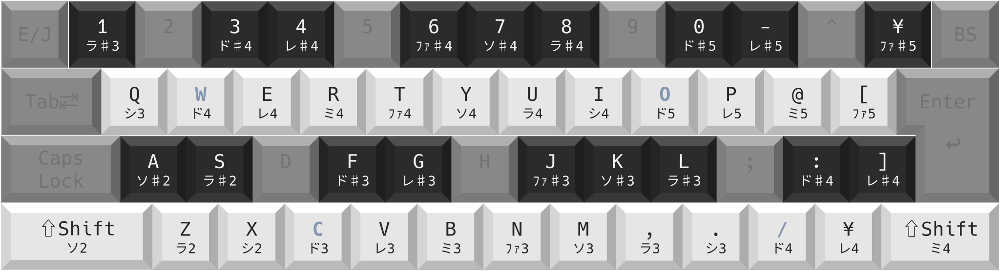

# Yume2kki Xylophone
「ゆめにっき」の非公式ファンゲーム[「ゆめ２っき」](https://wikiwiki.jp/yume2kki-t/)の[夢部屋](https://wikiwiki.jp/yume2kki-t/%E5%A4%A2%E9%83%A8%E5%B1%8B)に設置されている**木琴**を直感的に弾くための Windows (64bit) マクロです。

対応バージョン: ver0.123c 以降 (2024/05/09 21:00)

マクロ制作者: AlgaU

**Note: We currently support only JIS keyboard layouts.**

## 使い方
1. `Yume2kki_Xylophone.exe` を起動
2. 木琴の画面で `PgUp` キーを押すとマクロが起動します
3. `Esc` キーで終了

その他、詳細は基本操作を参照してください。

**ご注意: 高速で演奏した場合やその他ラグなどの要因で誤った音が演奏される場合があります！**

## 基本操作
### マクロの起動・一時停止・終了
- `Esc`: Yume2kki Xylophone の終了
- `PgUp`, `Page Up`: 起動・一時停止解除
- `PgDn`, `Page Down`: 一時停止・木琴画面の終了

### ピッチの変更
- `↓` (下向き矢印): ピッチのリセット (=0, **嬰ハ長調**)
- `←` (左向き矢印): ピッチダウン (-1)、最低 -6
- `→` (右向き矢印): ピッチアップ (+1)、最高 +5

### キーボードと階名の対応
- JIS キーボードと階名の対応は以下の画像のとおりです
- A♯3～A♯5 の範囲外の音は無音になります
- 起動時、ド3=A♯3

キー割り当ては次の 3 色で表されています
- 白色: 白鍵 (全音) です。対応する階名の音が演奏されます。
- 黒色: 黒鍵 (半音) です。対応する階名の音が演奏されます。
- 灰色: 未定義のキーです。反応しないか、通常のキーとして動作します。
